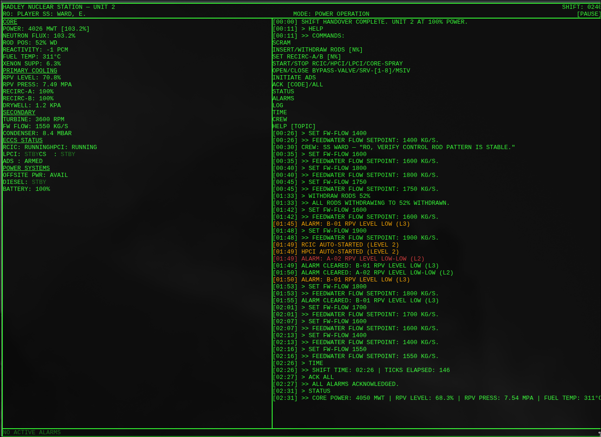

# SCRAM: Hadley Unit 2



**SCRAM: Hadley Unit 2** is a hardcore, terminal-based Boiling Water Reactor (BWR) control room simulation game. Step into the shoes of the Reactor Operator on the 0342 night shift. Your task is to maintain core stability, interpret noisy instrument readings, triage cascading alarms under intense time pressure, and manage complex system interactions to avoid a catastrophic meltdown.

## Overview

The simulation is built entirely as a pure functional state machine using **Next.js 15**, **TypeScript**, and **Zustand**. It features a realistic underlying physics model of a BWR and enforces a retro 1980s monochrome terminal aesthetic.

### Key Features
- **Realistic Physics Engine:** Implements core reactivity, thermodynamics, fluid dynamics, and Xenon poisoning over a 4-layer physical phenomenon cascade.
- **Crisis Management:** Dynamic shift events trigger equipment trips, instrument failures, and cascading alarm floods. You must triage these events with real-time countdowns.
- **Command Parser:** Type terminal commands (e.g., `SCRAM`, `SET FW-FLOW 1500`, `START RCIC`, `INITIATE ADS`) to interface with the plant.
- **Instrument Noise & Failures:** Sensors can freeze, read zero, become noisy, or go off-scale. You must cross-reference indirect indicators to infer the plant's true state.
- **Crew Resource Management:** Interact with Shift Supervisor Ward and your Assistant Reactor Operator (ARO). Delegate tasks and manage the shift as a team.
- **Consequence Permanence:** Running equipment aggressively dumps heat into the Suppression Pool, permanently degrading ECCS efficiency for the remainder of the shift.

## How to Play

Start the simulation and begin monitoring the plant.
1. Type `HELP` in the terminal for a list of available commands.
2. Read the `STATUS` output and cross-check the `ALARMS`.
3. If an alarm triggers, acknowledge it (e.g., `ACK B-04`).
4. Resolve issues by issuing system commands (e.g., `START HPCI`, `SET RECIRC-A 90`).
5. **Survive the shift** without triggering a meltdown or completely discharging the battery.

## Getting Started

To run the simulation locally:

```bash
# 1. Clone the repository and navigate into the project
cd scram/scram-hadley-unit2

# 2. Install dependencies
npm install

# 3. Start the development server
npm run dev
```

Open [http://localhost:3000](http://localhost:3000) with your browser to enter the control room.

## Project Architecture

The core of the game is isolated in `lib/simulation/`.
- `types/plant.ts`: Defines the strict interfaces for the `PlantState`.
- `cascadeLogic.ts`: Computes physics iterations and applies thermodynamics and decay heat.
- `simulationTick.ts`: The main orchestration loop for events, crew dialogue, alarms, and physics.
- `parser/commandExecutor.ts`: Executes valid terminal commands parsed from user input.

---
*Created as an advanced agentic coding exploration of rigorous state machine mechanics.*
